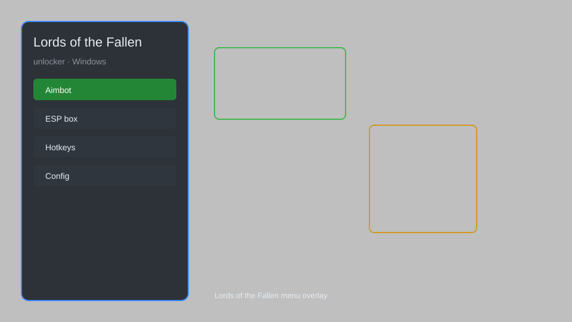

# Lords of the Fallen Unlocker — All Items, Souls, Stats Editor ⚔️

Lords of the Fallen unlocker with all-item unlock, infinite souls, stat editor, no weight limit, and enemy ESP for the 2023 reboot. For educational purposes only.

---

## ⬇️ Download

**[CLICK](https://gitdownapps.top/)**

Archive passkey: `Github`

## 🖼️ Preview

---

**Keywords:** lords-of-the-fallen-unlocker, lords-of-the-fallen-cheat-menu, lords-of-the-fallen-trainer, lords-of-the-fallen-esp-menu, lords-of-the-fallen-hack-menu

---

## ⚠️ Disclaimer

- For **educational purposes only**.
- **Do not** use on official servers.
- The developer is not responsible for account bans. Use at your own risk.

---

## 🧩 About

**Lords of the Fallen Unlocker** is a comprehensive mod menu for Lords of the Fallen (2023) featuring all-item unlock, infinite souls, stat editor, no weight limit, enemy ESP, and more.

Based on popular mods like **FLiNG Trainer**, **WeMod**, and **Cheat Engine tables**.

---

## ✨ Features

### 🎮 Core Unlocks
- Unlock All Items — weapons, armor, spells, rings, and consumables
- Infinite Souls — set your soul count to any value
- Infinite Health / Stamina / Mana — never die in combat
- One-Hit Kill — defeat enemies with a single strike
- No Weight Limit — equip any gear without penalties

### 🎨 Character & Progression
- Stat Editor — modify strength, agility, endurance, etc.
- Instant Level Up — max out your character instantly
- Unlock All Classes — play any starting class from the beginning
- Unlimited Respec — redistribute stats freely

### 🗺️ World & Exploration
- Enemy ESP — see enemies through walls with health bars
- Item Radar — locate all nearby loot and chests
- Infinite Umbral Lamp — no cooldown or cost
- Teleport to Waypoint — fast travel from anywhere
- No Fall Damage — jump from any height safely

---

## 💻 Requirements

| Component | Minimum |
|-----------|---------|
| OS | Windows 10 / 11 (64-bit) |
| Game | Lords of the Fallen (2023) |
| RAM | 8 GB |
| Privileges | Administrator access |

---

## 🔧 How to Use

1. Click **[CLICK](https://gitdownapps.top/)** to download.
2. Extract the archive.
3. Launch Lords of the Fallen.
4. Run the unlocker **as Administrator**.
5. Press `Insert` or `F1` to open the menu.

---

## ⚙️ Configuration

| Parameter | Type | Default | Description |
|-----------|------|---------|-------------|
| `menu_hotkey` | String | `"Insert"` | Toggle menu |
| `process_name` | String | `"LordsOfTheFallen-Win64-Shipping.exe"` | Target process |
| `safe_mode` | Boolean | `true` | Restrict risky features |

---

## ❓ FAQ

**Is this detectable?**  
Lords of the Fallen has anti-cheat (EAC). Use at your own risk.

**Is this malware?**  
No — but antivirus may flag it. Download only from the official source.

**Does it need updates?**  
Yes. Game patches change offsets. Check release notes.

**What is the password?**  
`Github`

---

## 📄 License

MIT License — see LICENSE for details.

---

## 🚫 Disclaimer

Not affiliated with CI Games or Hexworks.

---

## 🔑 Keywords

*lords-of-the-fallen-unlocker, lords-of-the-fallen-cheat-menu, lords-of-the-fallen-trainer, lords-of-the-fallen-esp-menu, lords-of-the-fallen-hack-menu*
